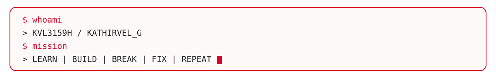
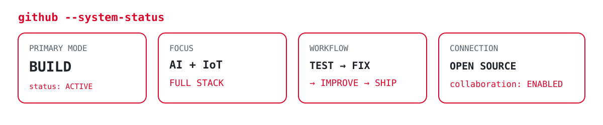

<div align="center">




<br/>

[](https://github.com/KVL3159H)
[](https://github.com/KVL3159H?tab=followers)
[](https://github.com/KVL3159H?tab=repositories)

</div>

---

# `root@kvl3159h:~# boot --profile`

```text
[BOOT] KVL Developer Environment
[ OK ] Loading problem-solving engine
[ OK ] Loading full-stack toolkit
[ OK ] Loading AI modules
[ OK ] Loading IoT / embedded interface
[ OK ] Loading project architecture
[ OK ] Loading curiosity
[ OK ] Loading persistence
[ !! ] Coffee level below recommended threshold
[ OK ] Fallback mode enabled

USER      : KATHIRVEL G
HANDLE    : KVL3159H
STATUS    : ONLINE
MODE      : BUILD
ACCESS    : OPEN TO COLLABORATION
UPTIME    : CONTINUOUS LEARNING

> SYSTEM READY
```

---

# `root@kvl3159h:~# whoami`

```yaml
name: "Kathirvel G"
username: "KVL3159H"
role: "Developer | Project Builder"
location: "India"

focus:
  - Full Stack Development
  - Artificial Intelligence
  - Internet of Things
  - Embedded Systems
  - Real-Time Applications
  - Automation
  - Engineering Prototypes

mission: >
  Convert ideas into systems that solve practical problems.
```

---

# `root@kvl3159h:~# cat mission.log`

```text
╔════════════════════════════════════════════════════════════════╗
║                     CURRENT OBJECTIVE                          ║
║                                                                ║
║        BUILD → TEST → IMPROVE → SHIP → LEARN → REPEAT         ║
╚════════════════════════════════════════════════════════════════╝

FULL STACK          █████████░░  ACTIVE
AI / ML             ████████░░░  ACTIVE
IoT / EMBEDDED      ████████░░░  ACTIVE
SYSTEM DESIGN       ███████░░░░  LOADING
OPEN SOURCE         ███████░░░░  EXPANDING
DOCUMENTATION       █████████░░  ACTIVE
PROBLEM SOLVING     ████████░░░  ACTIVE

NEXT CHECKPOINT:
> Build stronger systems.
> Write cleaner code.
> Ship better projects.
> Contribute more.
```

---

# `root@kvl3159h:~# ls ./featured-projects`

<table>
<tr>
<td width="50%" valign="top">

### 🚑 [AmbulanceLaneFree](https://github.com/KVL3159H/AmbulanceLaneFree)

```text
TYPE    : Smart Emergency System
STACK   : Python / Android / IoT
STATUS  : ACTIVE
MISSION : Emergency traffic priority
```

Smart emergency-priority traffic project focused on ambulance movement, intelligent junction control, telemetry, and system integration.

</td>
<td width="50%" valign="top">

### ♻️ [360 Waste Management](https://github.com/KVL3159H/360-waste-management)

```text
TYPE    : Smart Waste Platform
STACK   : React / TypeScript / Firebase
STATUS  : ACTIVE
MISSION : Data-driven waste management
```

Role-based waste-management platform with dashboards, QR workflows, analytics, mapping, and AI-assisted features.

</td>
</tr>

<tr>
<td width="50%" valign="top">

### ⚡ [Waste-to-Energy](https://github.com/KVL3159H/Waste-to-Energy)

```text
TYPE    : IoT Monitoring Dashboard
STACK   : React / Firebase / Analytics
STATUS  : ACTIVE
MISSION : Waste → useful energy insights
```

Telemetry and analytics dashboard for monitoring waste-to-energy systems, environmental metrics, alerts, and operational data.

</td>
<td width="50%" valign="top">

### 🌱 [earth-growth-garden-main](https://github.com/KVL3159H/earth-growth-garden-main)

```text
TYPE    : Real-Time Web Experience
STACK   : React / Socket.IO / Express
STATUS  : EXPERIMENT
MISSION : Visualize collective growth
```

Interactive digital garden experiment using real-time communication and visual progress.

</td>
</tr>

<tr>
<td width="50%" valign="top">

### 📄 [Research Paper Review System](https://github.com/KVL3159H/RESEARCH-PAPER-SUBMISSION---REVIEW-SYSTEM)

```text
TYPE    : Academic Workflow System
STACK   : Web / SQL
STATUS  : BUILT
MISSION : Simplify peer-review workflow
```

Submission and peer-review workflow for authors, reviewers, and editors.

</td>
<td width="50%" valign="top">

### ⏳ [Squid Game Countdown](https://github.com/KVL3159H/squid-game-countdown-clocker)

```text
TYPE    : Cinematic Event UI
STACK   : Next.js / React / TypeScript
STATUS  : BUILT
MISSION : Immersive countdown experience
```

Full-screen cinematic countdown interface for CTF and event environments.

</td>
</tr>
</table>

---

# `root@kvl3159h:~# ./tech_arsenal.sh`

### `[ LANGUAGES ]`

<p>


</p>

### `[ FRONTEND ]`

<p>


</p>

### `[ BACKEND / DATA ]`

<p>


</p>

### `[ HARDWARE / IoT ]`

<p>


</p>

### `[ TOOLS ]`

<p>


</p>

---

# `root@kvl3159h:~# github --status`

<div align="center">



</div>

```text
PROFILE        : KVL3159H
PUBLIC MODE    : ENABLED
PROJECT MODE   : ACTIVE
DOCUMENTATION  : IMPROVING
OPEN SOURCE    : EXPANDING

> Native GitHub contribution activity is visible directly below this profile README.
> Repositories: https://github.com/KVL3159H?tab=repositories
```

---

# `root@kvl3159h:~# cat build_queue.txt`

```text
[01] Smart emergency traffic systems ............... RUNNING
[02] AI-assisted applications ....................... RUNNING
[03] IoT + sensor integration ....................... RUNNING
[04] Full-stack platforms ........................... RUNNING
[05] Open-source contributions ...................... QUEUED
[06] Better testing + CI/CD ......................... QUEUED
[07] Stronger system architecture ................... QUEUED
[08] Next ambitious project ......................... UNKNOWN
```

---

# `root@kvl3159h:~# cat philosophy.cpp`

```cpp
#include <life.h>

int main() {

    while (alive()) {

        learn();
        build();
        test();

        if (broken()) {
            debug();
            fix();
        }

        improve();
        ship();
    }

    return 0;
}
```

---

# `root@kvl3159h:~# cat rules.conf`

```ini
[developer]
curiosity=true
consistency=true
documentation=true
continuous_learning=true

[project]
solve_real_problem=true
clean_structure=true
test_before_ship=true
never_stop_improving=true

[system]
fear_of_failure=false
next_project=always
```

---

# `root@kvl3159h:~# connect --user KVL3159H`

<p align="center">
<a href="https://github.com/KVL3159H">

</a>
</p>

---

<div align="center">

```text
┌──────────────────────────────────────────────────────────────┐
│                                                              │
│   > There is no final build.                                 │
│   > There is only the next version.                          │
│                                                              │
│   STATUS : ONLINE                                            │
│   MODE   : BUILD                                             │
│   NEXT   : ./project                                         │
│                                                              │
└──────────────────────────────────────────────────────────────┘
```


</div>
