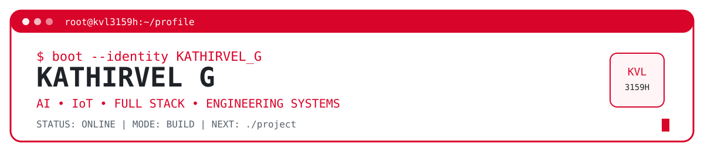
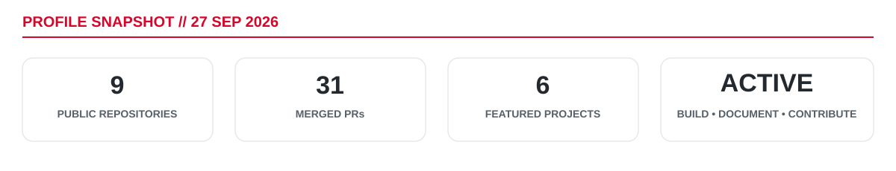
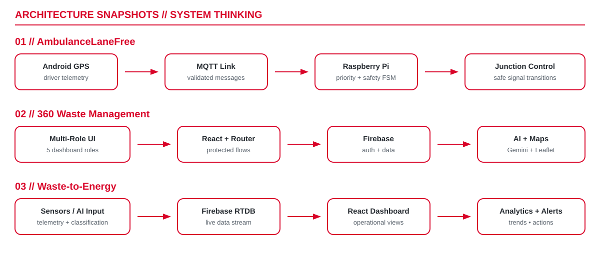
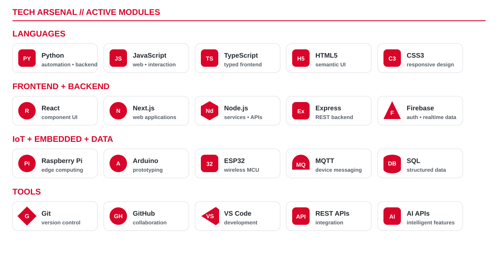

<div align="center">



### Final-Year Engineering Developer · Full-Stack · AI/ML · IoT · Embedded Systems

I build practical software and connected systems, with an emphasis on **real-world problem solving, system integration, documentation, and measurable project outcomes**.

[GitHub](https://github.com/KVL3159H) · [Repositories](https://github.com/KVL3159H?tab=repositories)

</div>

---

# `root@kvl3159h:~# whoami`

```yaml
name: "Kathirvel G"
username: "KVL3159H"
status: "Building, testing, documenting and shipping projects"

core_focus:
  - Full-Stack Development
  - AI / ML Integration
  - IoT & Embedded Systems
  - Real-Time Applications
  - System Design
  - Engineering Prototypes

engineering_style:
  - solve practical problems
  - connect software with hardware
  - document systems clearly
  - improve through testing and iteration
```

<div align="center">



</div>

> Snapshot values are based on the current profile as of **27 Sep 2026**. GitHub's native contribution graph and achievements remain visible on the profile itself.

---

# `root@kvl3159h:~# ls ./featured-projects --proof`

## 🚑 [AmbulanceLaneFree](https://github.com/KVL3159H/AmbulanceLaneFree)

**Problem** — Emergency vehicles can lose critical time at traffic junctions.

**What I built** — A smart emergency-priority prototype combining Android GPS telemetry, MQTT communication, a Raspberry Pi control layer, safe signal-state logic, and a multi-ambulance priority queue.

**Tech** — Python · PySide6 · Android/Kotlin · MQTT · SQLite · Raspberry Pi

**My role** — System integration, application logic, junction-control workflow, telemetry pipeline, UI/documentation.

**Technical proof** — Four-way junction model, mobile GPS flow, validation logic, fail-safe state transitions, multi-ambulance prioritization, Windows/Raspberry Pi software.

---

## ♻️ [360 Waste Management](https://github.com/KVL3159H/360-waste-management)

**Problem** — Waste operations need different views for households, collectors, officers, administrators, and departments.

**What I built** — A multi-role waste-management platform with protected dashboards, QR workflows, route maps, smart-bin views, analytics, and AI-assisted features.

**Tech** — React · TypeScript · Vite · Firebase · Gemini · Leaflet · Recharts

**My role** — Front-end architecture, role workflows, dashboard design, AI/map integration, documentation.

**Technical proof** — **5 user-role experiences** in one application plus QR, mapping, analytics, and AI-assisted workflows.

---

## ⚡ [Waste-to-Energy](https://github.com/KVL3159H/Waste-to-Energy)

**Problem** — Operational sensor data needs to be understandable quickly.

**What I built** — A monitoring dashboard for live telemetry, energy metrics, classification data, alerts, historical analytics, and carbon-offset estimates.

**Tech** — React · Firebase Realtime Database · Recharts · JavaScript

**My role** — Dashboard architecture, realtime data flow, analytics presentation, operational UI.

**Technical proof** — **4 main operational views:** Telemetry, Analytics, AI Vision, and Alerts.

---

## 📄 [Research Paper Submission & Review System](https://github.com/KVL3159H/RESEARCH-PAPER-SUBMISSION---REVIEW-SYSTEM)

**Problem** — Academic paper review involves multiple users and state transitions.

**What I built** — A structured workflow prototype for authors, reviewers, and editors covering submission, reviewer assignment, scoring, feedback, and final decisions.

**Tech** — HTML · CSS · JavaScript · SQL

**Technical proof** — **3-role workflow:** Author → Reviewer → Editor.

---

## ⏳ [Squid Game Countdown](https://github.com/KVL3159H/squid-game-countdown-clocker)

**Problem** — Timed CTF/event environments need a visually strong countdown experience.

**What I built** — A full-screen cinematic countdown UI with background rotation, warning states, final-phase effects, and fullscreen controls.

**Tech** — Next.js · React · TypeScript

**Technical proof** — **2-hour countdown**, **30 rotating visual assets**, danger-mode behavior, fullscreen event flow.

---

## 🌱 [Earth Growth Garden](https://github.com/KVL3159H/earth-growth-garden-main)

**Problem** — Shared participation can feel abstract without visible feedback.

**What I built** — A collaborative digital-garden experience where contribution events update shared state in real time.

**Tech** — React · TypeScript · Express · Socket.IO · Vite

**Technical proof** — Real-time multi-client state updates using Socket.IO.

---

# `root@kvl3159h:~# cat achievements.log`

```text
[ACHIEVEMENT] Smart India Hackathon Finalist
[ACHIEVEMENT] Robothon 2K24 — ₹5,000 Cash Prize
[ACHIEVEMENT] Wonders of AI 2.0 — Top 8 / 50
[EXPERIENCE ] CTF Organizer / Coordinator
[PROFILE    ] 20 merged GitHub pull requests in current snapshot
```

These achievements represent project building, technical competition exposure, teamwork, coordination, and continued GitHub contribution.

---

# `root@kvl3159h:~# ./architecture --show`

<div align="center">



</div>

The diagrams above show how I think about systems: **input → communication/data layer → processing → operational output**.

---

# `root@kvl3159h:~# ./tech_arsenal.sh --verified`

<div align="center">



</div>

I keep this section limited to technologies I have used in projects rather than listing tools only for appearance.

---

# `root@kvl3159h:~# cat currently_learning.yml`

```yaml
currently_learning:
  - Docker & containerized development
  - CI/CD and GitHub Actions
  - System design fundamentals
  - Cloud deployment fundamentals
  - Backend/API architecture
  - Testing and production hardening
  - AI/LLM integration patterns

goal:
  "Move from working prototypes to reliable, deployable engineering systems."
```

---

# `root@kvl3159h:~# cat engineering_principles.conf`

```ini
[build]
solve_real_problem=true
prototype_fast=true
document_clearly=true

[quality]
test_before_ship=true
security_matters=true
fail_safe_when_needed=true

[growth]
learn_continuously=true
accept_feedback=true
open_source=expanding

[next]
project=always
```

---

# `root@kvl3159h:~# connect`

I am interested in collaboration around:

- Full-stack applications
- AI-enabled software
- IoT and embedded systems
- Smart-city / emergency-response systems
- Engineering prototypes
- Open-source project improvements

**GitHub:** [@KVL3159H](https://github.com/KVL3159H)

---

<div align="center">

```text
> BRANDING IS USEFUL.
> WORKING SYSTEMS ARE BETTER.
> PROOF IS BEST.

STATUS : ONLINE
MODE   : BUILD
NEXT   : ./project
```


</div>
