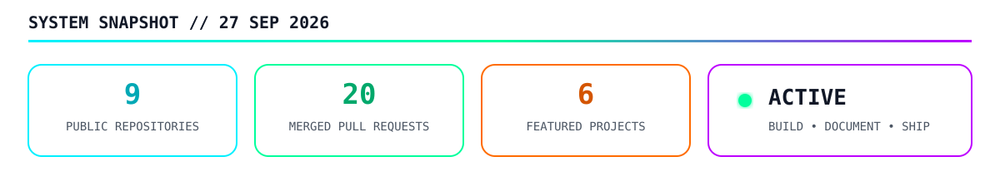
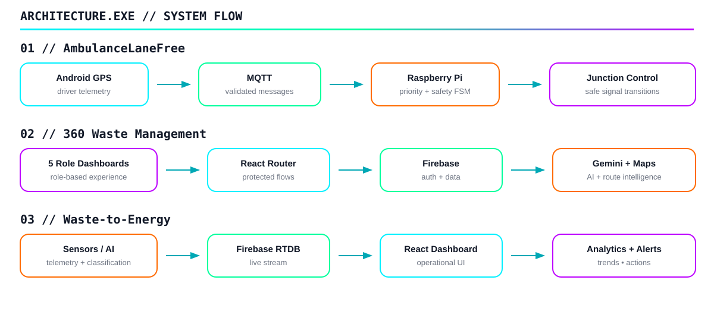
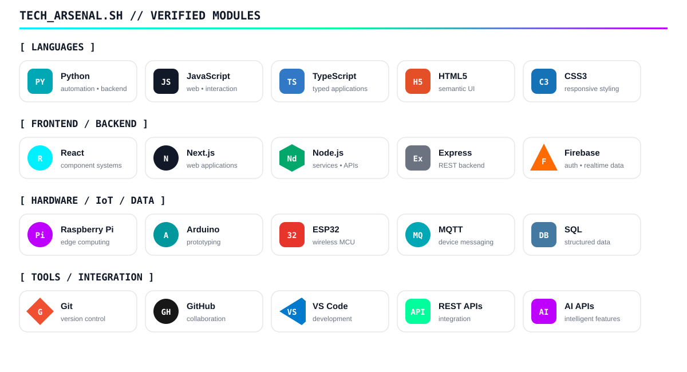
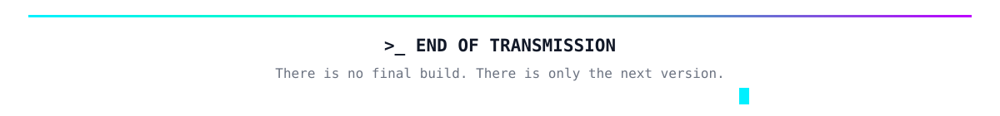

<!-- ═══════════════════════════════════════════════════════════════════════ -->
<!--                                                                         -->
<!--              ⚡ KATHIRVEL G — ULTIMATE ANIMATED PROFILE ⚡               -->
<!--                                                                         -->
<!--         Designed for impact. Engineered for proof. Built to ship.       -->
<!--                                                                         -->
<!-- ═══════════════════════════════════════════════════════════════════════ -->

<!-- ╔═══════════════════════════════════════════════════════════════════╗ -->
<!-- ║                     🎬 ANIMATED HEADER SECTION                    ║ -->
<!-- ╚═══════════════════════════════════════════════════════════════════╝ -->

<div align="center">

<!-- Waving gradient banner -->


<!-- Terminal header (your existing SVG) -->


<br/>

<!-- Animated typing headline -->
<a href="https://github.com/KVL3159H">
  
</a>

<br/>

<!-- Neon status pills -->
<p>
  
  
  
  
</p>

<!-- Social badges -->
<p>
  <a href="https://github.com/KVL3159H"></a>
  <a href="https://github.com/KVL3159H?tab=repositories"></a>
  
  
</p>

### ⚡ Final-Year Engineering Developer
### Full-Stack · AI/ML · IoT · Embedded Systems

> *I build practical software and connected systems — with an emphasis on*
> **real-world problem solving · system integration · documentation · measurable outcomes.**

</div>

<!-- ═══════════════════════════════════════════════════════════════════ -->
<!--                          IDENTITY BLOCK                            -->
<!-- ═══════════════════════════════════════════════════════════════════ -->


<div align="center">

## <samp>`root@kvl3159h:~# whoami`</samp>

</div>

```yaml
╔══════════════════════════════════════════════════════════════════════╗
║  ⚡ IDENTITY MATRIX                                                  ║
╠══════════════════════════════════════════════════════════════════════╣
║                                                                      ║
║   name       ▸ "Kathirvel G"                                         ║
║   username   ▸ "KVL3159H"                                            ║
║   status     ▸ "Building · Testing · Documenting · Shipping"         ║
║                                                                      ║
╠══════════════════════════════════════════════════════════════════════╣
║  🎯 CORE FOCUS                                                       ║
╠══════════════════════════════════════════════════════════════════════╣
║   ▸ Full-Stack Development          ▸ Real-Time Applications         ║
║   ▸ AI / ML Integration             ▸ System Design                  ║
║   ▸ IoT & Embedded Systems          ▸ Engineering Prototypes         ║
║                                                                      ║
╠══════════════════════════════════════════════════════════════════════╣
║  🧠 ENGINEERING STYLE                                                ║
╠══════════════════════════════════════════════════════════════════════╣
║   ▸ Solve practical problems                                        ║
║   ▸ Connect software with hardware                                  ║
║   ▸ Document systems clearly                                        ║
║   ▸ Improve through testing & iteration                             ║
║                                                                      ║
╚══════════════════════════════════════════════════════════════════════╝
```

<!-- ═══════════════════════════════════════════════════════════════════ -->
<!--                         SYSTEM SNAPSHOT                            -->
<!-- ═══════════════════════════════════════════════════════════════════ -->

<div align="center">

## <samp>`root@kvl3159h:~# systemctl status profile`</samp>



</div>

> **Live profile snapshot:** 9 public repositories · 20 merged pull requests · 6 featured projects.  
> GitHub's native contribution graph and achievement badges remain visible directly on the profile.

---

<!-- ═══════════════════════════════════════════════════════════════════ -->
<!--                         MISSION DASHBOARD                          -->
<!-- ═══════════════════════════════════════════════════════════════════ -->

<div align="center">

## <samp>`root@kvl3159h:~# cat mission.log`</samp>

</div>

```text
╔══════════════════════════════════════════════════════════════════════╗
║                      ⚡ CURRENT OBJECTIVE                            ║
╠══════════════════════════════════════════════════════════════════════╣
║                                                                      ║
║   BUILD → TEST → DOCUMENT → IMPROVE → SHIP → LEARN → REPEAT         ║
║                                                                      ║
╠══════════════════════════════════════════════════════════════════════╣
║  ACTIVE MODULES                                                      ║
╠══════════════════════════════════════════════════════════════════════╣
║   Full Stack          █████████░░   ACTIVE                           ║
║   AI / ML             ████████░░░   ACTIVE                           ║
║   IoT / Embedded      ████████░░░   ACTIVE                           ║
║   System Design       ███████░░░░   LOADING                          ║
║   Open Source         ███████░░░░   EXPANDING                        ║
║   Documentation       █████████░░   ACTIVE                           ║
║                                                                      ║
╚══════════════════════════════════════════════════════════════════════╝
```

---

<!-- ═══════════════════════════════════════════════════════════════════ -->
<!--                         FEATURED PROJECTS                          -->
<!-- ═══════════════════════════════════════════════════════════════════ -->

<div align="center">

## <samp>`root@kvl3159h:~# ls ./featured-projects --proof`</samp>

### Real systems. Real architecture. Real technical evidence.

</div>

### 🚑 [AmbulanceLaneFree](https://github.com/KVL3159H/AmbulanceLaneFree)

```text
TYPE       : Smart Emergency Traffic System
STACK      : Python • PySide6 • Android/Kotlin • MQTT • SQLite • Raspberry Pi
PROBLEM    : Emergency vehicles lose critical time at traffic junctions.
BUILT      : GPS telemetry + validated communication + priority logic + safe signal FSM.
MY ROLE    : System integration • control logic • UI • telemetry • documentation
PROOF      : 4-way junction + multi-ambulance queue + fail-safe transitions + mobile GPS
```

### ♻️ [360 Waste Management](https://github.com/KVL3159H/360-waste-management)

```text
TYPE       : Multi-Role Smart Waste Platform
STACK      : React • TypeScript • Vite • Firebase • Gemini • Leaflet • Recharts
PROBLEM    : Different waste stakeholders need different operational views.
BUILT      : Household + Collector + Officer + Admin + Department workflows.
MY ROLE    : Frontend architecture • role flows • AI/maps • dashboard design
PROOF      : 5 user-role experiences + QR + analytics + mapping + AI assistance
```

### ⚡ [Waste-to-Energy](https://github.com/KVL3159H/Waste-to-Energy)

```text
TYPE       : Real-Time Monitoring Dashboard
STACK      : React • Firebase Realtime Database • Recharts • JavaScript
PROBLEM    : Live plant telemetry must be understandable quickly.
BUILT      : Sensor monitoring + energy metrics + AI vision + alerts + analytics.
MY ROLE    : Dashboard architecture • realtime data flow • operational UI
PROOF      : Telemetry + Analytics + AI Vision + Alerts
```

### 📄 [Research Paper Submission & Review System](https://github.com/KVL3159H/RESEARCH-PAPER-SUBMISSION---REVIEW-SYSTEM)

```text
TYPE       : Academic Workflow System
STACK      : HTML • CSS • JavaScript • SQL
PROBLEM    : Paper review involves multiple users and workflow states.
BUILT      : Submission + reviewer assignment + scoring + editorial decisions.
PROOF      : Author → Reviewer → Editor workflow
```

### ⏳ [Squid Game Countdown](https://github.com/KVL3159H/squid-game-countdown-clocker)

```text
TYPE       : Cinematic Event / CTF Interface
STACK      : Next.js • React • TypeScript
BUILT      : Fullscreen countdown + rotating visuals + warning states + danger mode.
PROOF      : 2-hour timer + 30 visual assets + cinematic final-phase behaviour
```

### 🌱 [Earth Growth Garden](https://github.com/KVL3159H/earth-growth-garden-main)

```text
TYPE       : Real-Time Collaborative Web Experience
STACK      : React • TypeScript • Express • Socket.IO • Vite
BUILT      : Shared contribution state with live multi-client updates.
PROOF      : Socket.IO real-time participation pipeline
```

---

<!-- ═══════════════════════════════════════════════════════════════════ -->
<!--                          ARCHITECTURE                              -->
<!-- ═══════════════════════════════════════════════════════════════════ -->

<div align="center">

## <samp>`root@kvl3159h:~# ./architecture.exe --show`</samp>



</div>

```text
SYSTEM THINKING:
INPUT → COMMUNICATION / DATA LAYER → PROCESSING → OPERATIONAL OUTPUT
```

---

<!-- ═══════════════════════════════════════════════════════════════════ -->
<!--                          TECH ARSENAL                              -->
<!-- ═══════════════════════════════════════════════════════════════════ -->

<div align="center">

## <samp>`root@kvl3159h:~# ./tech_arsenal.sh --verified`</samp>



</div>

> I keep this section focused on technologies I have actually used in projects rather than listing tools only for appearance.

---

<!-- ═══════════════════════════════════════════════════════════════════ -->
<!--                           ACHIEVEMENTS                             -->
<!-- ═══════════════════════════════════════════════════════════════════ -->

<div align="center">

## <samp>`root@kvl3159h:~# cat achievements.log`</samp>

</div>

```text
[COMPETITION ] Smart India Hackathon Finalist
[AWARD       ] Robothon 2K24 — ₹5,000 Cash Prize
[AI EVENT    ] Wonders of AI 2.0 — Top 8 / 50
[LEADERSHIP  ] CTF Organizer / Coordinator
[GITHUB      ] 20 merged pull requests in current profile snapshot
```

These represent **technical competition exposure, project execution, teamwork, coordination, and consistent GitHub contribution**.

---

<!-- ═══════════════════════════════════════════════════════════════════ -->
<!--                        CURRENTLY LEARNING                          -->
<!-- ═══════════════════════════════════════════════════════════════════ -->

<div align="center">

## <samp>`root@kvl3159h:~# cat currently_learning.yml`</samp>

</div>

```yaml
currently_learning:
  - Docker & containerized development
  - CI/CD and GitHub Actions
  - System design fundamentals
  - Cloud deployment fundamentals
  - Backend / API architecture
  - Testing and production hardening
  - AI / LLM integration patterns

target:
  "Move from working prototypes to reliable, deployable engineering systems."
```

---

<!-- ═══════════════════════════════════════════════════════════════════ -->
<!--                           BUILD QUEUE                              -->
<!-- ═══════════════════════════════════════════════════════════════════ -->

<div align="center">

## <samp>`root@kvl3159h:~# cat build_queue.txt`</samp>

</div>

```text
[01] Smart emergency traffic systems ............... RUNNING
[02] AI-assisted applications ...................... RUNNING
[03] IoT + sensor integration ...................... RUNNING
[04] Full-stack platforms .......................... RUNNING
[05] Open-source contributions ..................... EXPANDING
[06] Better testing + CI/CD ........................ QUEUED
[07] Stronger system architecture .................. QUEUED
[08] Cloud deployment .............................. QUEUED
[09] Next ambitious project ........................ UNKNOWN
```

---

<!-- ═══════════════════════════════════════════════════════════════════ -->
<!--                       ENGINEERING PRINCIPLES                       -->
<!-- ═══════════════════════════════════════════════════════════════════ -->

<div align="center">

## <samp>`root@kvl3159h:~# cat engineering_principles.conf`</samp>

</div>

```ini
[build]
solve_real_problem=true
prototype_fast=true
document_clearly=true

[quality]
test_before_ship=true
security_matters=true
fail_safe_when_needed=true

[growth]
learn_continuously=true
accept_feedback=true
open_source=expanding

[next]
project=always
```

<div align="center">

## <samp>`root@kvl3159h:~# cat philosophy.cpp`</samp>

</div>

```cpp
while (alive()) {

    learn();
    build();
    test();

    if (broken()) {
        debug();
        fix();
    }

    document();
    improve();
    ship();
}
```

---

<!-- ═══════════════════════════════════════════════════════════════════ -->
<!--                             CONNECT                               -->
<!-- ═══════════════════════════════════════════════════════════════════ -->

<div align="center">

## <samp>`root@kvl3159h:~# connect --user KVL3159H`</samp>

I'm interested in collaboration around:

**Full-Stack · AI-Enabled Software · IoT · Embedded Systems · Smart-City Systems · Engineering Prototypes · Open Source**

<br/>

<a href="https://github.com/KVL3159H"></a>
<a href="https://github.com/KVL3159H?tab=repositories"></a>

<br/><br/>

```text
╔══════════════════════════════════════════════════════════════════════╗
║                                                                      ║
║  > BRANDING IS USEFUL.                                               ║
║  > WORKING SYSTEMS ARE BETTER.                                       ║
║  > PROOF IS BEST.                                                    ║
║                                                                      ║
║  STATUS : ONLINE                                                     ║
║  MODE   : BUILD                                                      ║
║  NEXT   : ./project                                                  ║
║                                                                      ║
╚══════════════════════════════════════════════════════════════════════╝
```



</div>
